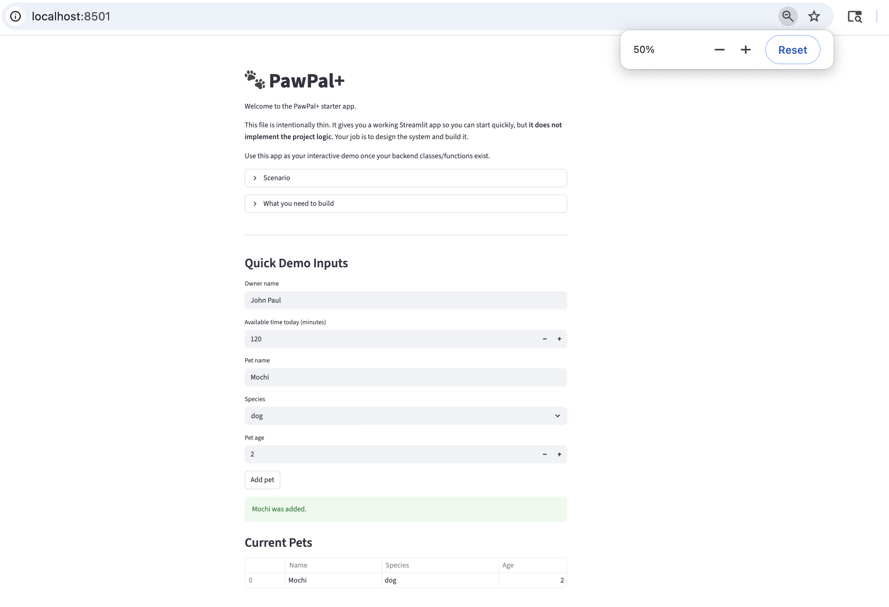
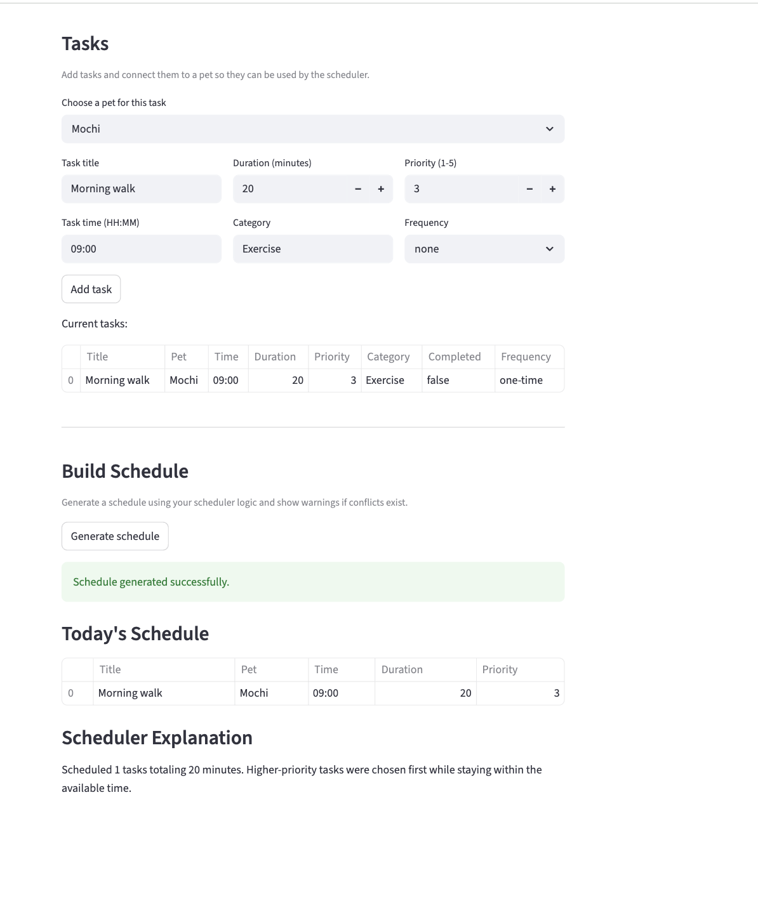

# PawPal+ (Pet Care Scheduler)

You are building **PawPal+**, a Streamlit app that helps a pet owner plan care tasks for their pet.


## Scenario

A busy pet owner needs help staying consistent with pet care. They want an assistant that can:

- Track pet care tasks (walks, feeding, meds, enrichment, grooming, etc.)
- Consider constraints (time available, priority, owner preferences)
- Produce a daily plan and explain why it chose that plan

Your job is to design the system first (UML), then implement the logic in Python, then connect it to the Streamlit UI.

## What you will build

Your final app should:

- Let a user enter basic owner + pet info
- Let a user add/edit tasks (duration + priority at minimum)
- Generate a daily schedule/plan based on constraints and priorities
- Display the plan clearly (and ideally explain the reasoning)
- Include tests for the most important scheduling behaviors


## Getting started

### Setup

```bash
python -m venv .venv
source .venv/bin/activate  # Windows: .venv\Scripts\activate
pip install -r requirements.txt
```

### Suggested workflow

1. Read the scenario carefully and identify requirements and edge cases.
2. Draft a UML diagram (classes, attributes, methods, relationships).
3. Convert UML into Python class stubs (no logic yet).
4. Implement scheduling logic in small increments.
5. Add tests to verify key behaviors.
6. Connect your logic to the Streamlit UI in `app.py`.
7. Refine UML so it matches what you actually built.


## Intro to PawPal

PawPal+ is a pet care scheduling app that helps organize daily tasks for pet owners. The idea is to take all the tasks you need to do—like feeding, walking, or grooming—and automatically turn them into a structured plan based on your available time and task priorities. Instead of manually planning everything, the app sorts tasks, filters them if needed, and checks for any scheduling conflicts so things don’t overlap. The system is designed using object-oriented programming, where an Owner has multiple Pets, each Pet has its own Tasks, and a Scheduler handles all the logic to generate the plan. It also supports recurring tasks and explains how the schedule was created, so it’s not just a black box. Overall, the goal of PawPal+ is to make managing pet care easier and more organized without requiring much effort from the user.


## Features

- Track pet care tasks (feeding, walking, grooming, etc.)
- Generate a daily schedule based on time and priority
- Sort tasks chronologically (HH:MM format)
- Filter tasks by completion status or pet
- Support recurring tasks (daily/weekly)
- Detect scheduling conflicts
- Explain scheduling decisions


## Demo
<a href="PawPal_Demo1.png" target="_blank">
  
</a>

<a href="PawPal_Demo2.png" target="_blank">
  
</a>
## How It Works

The system follows an object-oriented design:

- **Owner** → manages pets and availability  
- **Pet** → stores tasks  
- **Task** → represents individual care activities  
- **Scheduler** → processes tasks and generates a plan  

The Scheduler:
- Collects all tasks  
- Sorts them by priority and time  
- Filters based on constraints  
- Detects conflicts  
- Produces a structured daily plan  

## Smarter Scheduling

The PawPal+ system was improved with a few algorithmic features to make scheduling more useful and realistic. Tasks can now be sorted by time in "HH:MM" format, which makes it easier to view them in chronological order. The system can also filter tasks by completion status or by pet name, which helps organize tasks when there are multiple pets or many activities. In addition, recurring tasks are supported, so when a daily or weekly task is marked complete, a new instance is automatically created for the next occurrence. Finally, the scheduler includes basic conflict detection, which checks for tasks scheduled at the same time and returns a warning instead of crashing. These additions make the app smarter, more flexible, and closer to a real pet-care scheduling tool.


## Testing PawPal+

The automated tests could be run using the command python -m pytest. The test suite covers the main functionality of the system, including marking tasks as complete, adding tasks to pets, sorting tasks by time, handling recurring tasks, and detecting scheduling conflicts. I tried to include both normal scenarios and some edge cases, like tasks with the same time or recurring tasks creating new instances. I would rate my confidence level around 4 out of 5. At the beginning, I did struggle a bit with getting the logic right, especially when writing and refining the test cases. I had to go back and rethink parts of my implementation to make sure the tests were meaningful and accurate. However, going through that process helped me better understand my own code and improved how I approach testing, which made me feel more confident as a developer in a way.


